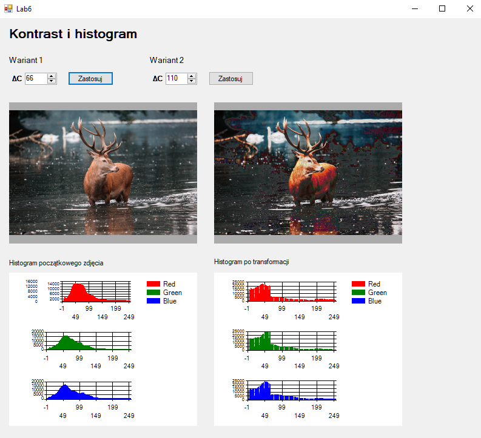
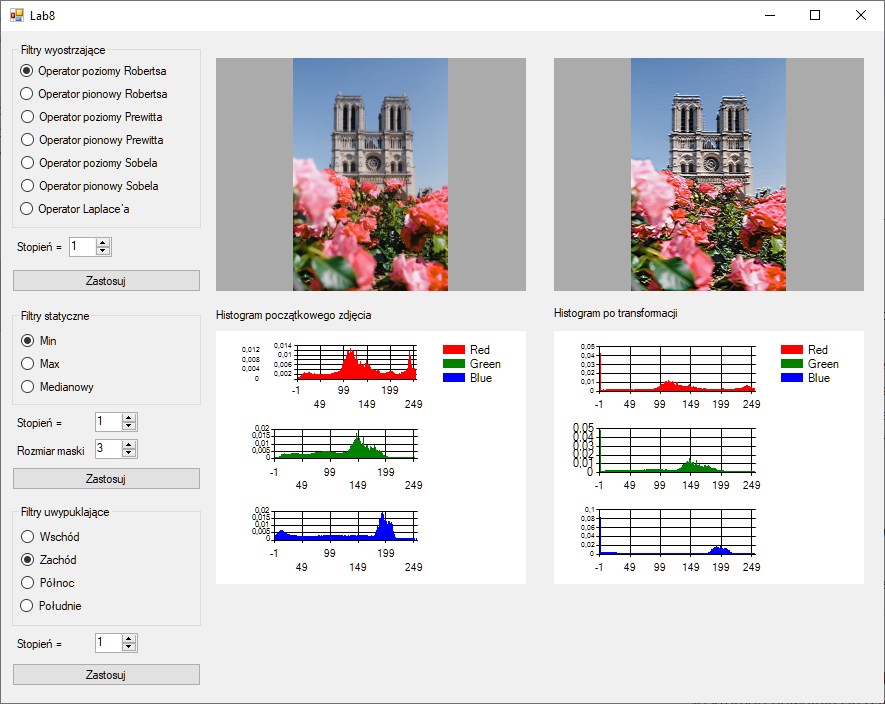

# Laboratorium I 03-03-2021
Skrypt generuje ilustrację drzewa, które wygląda inaczej za każdym razem.
## Opis
Podstawą drzewa jest drzewo fraktalne generowane rekurencyjnie. Następnie dodałem czynnik losowy do długości gałęzi, kąta między gałęziami oraz ilości jabłek na na ostatnich gałęziach (liściach). Drzewo jest rysowane przy pomocy biblioteki [Pyglet](http://pyglet.org/). Opis kodu znajduję się bezpośrednio w skrypcie.
## Jak włączyć
```bash
pip3 install pyglet
py 2d.py
```
## Zdjęcia



