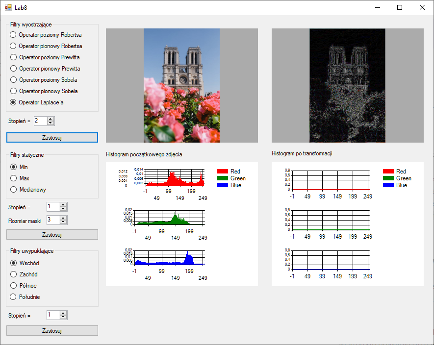
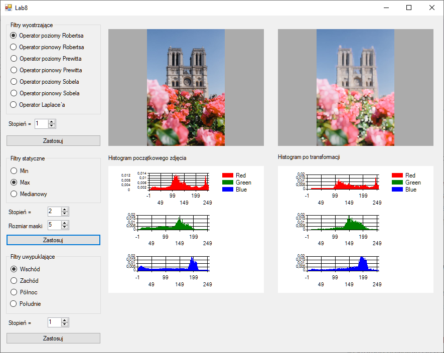

# Laboratorium VIII 09-05-2021
Filtry wyostrzające, filtry statyczne.

## Jak uruchomić
1. Uruchomić ```lab6_intensywnosc_histogram/bin/debug/lab6_intensywnosc_histogram.exe```
2. Lub załadować projekt w Visual Studio

## Informacje
Aby wybrać zdjęcie do edycji, należy kliknąć w pierwszy kwadrat. Pierwszy histogram wygeneruje się po wybraniu zdjęcia. Drugi po dokonaniu edycji.
Proszę unikać zdjęć o dużych rozdzielczościach gdyż algorytmy obliczające zdjęcie wyjściowe nie zostały oddelegowane do innego wątku - aplikacja po jakimś czasie może się zawiesić.

## Innowacje
1. Do każdego filtra można wybrać stopień. Tzn. ile razy użyć go na zdjęciu.
2. Przy filtrach statycznych możliwość wyboru rozmiaru maski (tylko wartości nieparzyste).
3. Dodano również filtry uwypuklające z 4 stron. Nadają zdjęciu wrażenie wypukłości na krawędziach. Implementacja przy pomocy http://www.algorytm.org/przetwarzanie-obrazow/filtrowanie-obrazow.html

## Zdjęcie


